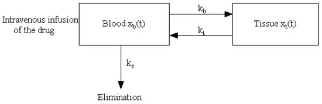

# Modelling the Pharmacokinetics of Pain Opioids (Methadone, Buprenorphine, Tramadol, and Tapentado)

### Approach
- We use a two compartment model for this analysis to compare the ADME (absorption, distribution, metabolism and excretion) of the drugs highlighted.
- The resulting differential equations are numerically solved using the 4th order Runge-Kutta method.

### Common information about the Opioids.
|Drug|Dosage|Molecular Weight|Method of Delivery|   
|:---|:---|:---|:---|
|Buprenorphine  |0.3mg   |467.64g/mol       |Infusion              |
|Methadone      |2.5-10mg|309.445mg/mol     |Infusion              |
|Tramadol       |50mg    |263.38g/mol       |Infusion              |
|Tapentadol     |50mg    |221.339g/mol      |Gastrointestinal Tract|


- It is also key to gather the distribution rate constants such k~b~, k~e~, and k~t~ from pharmaceutical studies among patients.
- These constants are distribution rates in blood (1st compartments), excretion rate through renal channels and distribution in tissue (2nd Compartment) respectively.

### The Model

 
 #### Central Compartment 
```math
$$
\frac{\text{d}x_b}{\text{d}t} = -(k_b + k_e)x_b(t) + k_tx_t(t)\\
$$
```

#### Peripheral Compartment
```math
$$
\frac{\text{d}x_t}{\text{d}t} = k_bx_b(t) - k_tx_t(t)
$$
```


### Results
- The results captured observe the dynamics of drug concentration in different compartments over time.

